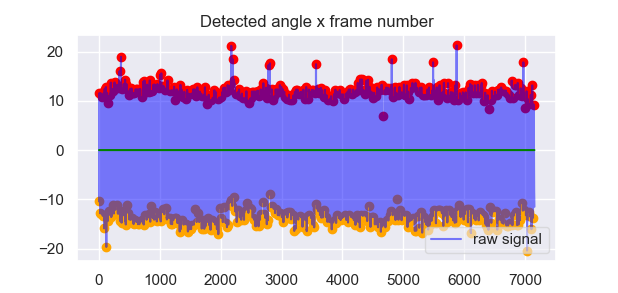
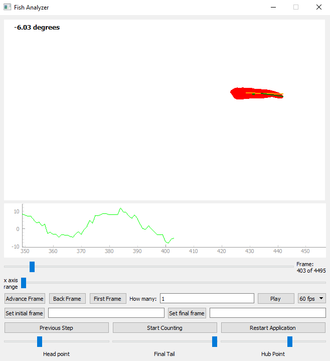
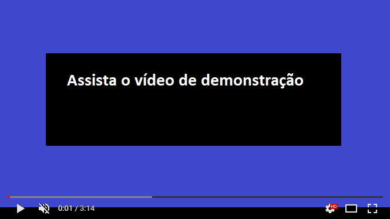

# fish analyzer
Software analizador do batimento caudal de peixes

# Financiamento do projeto: 

Fundação de Amparo à Pesquisa do Estado do Amazonas (FAPEAM - Edital Universal 2018)

# Instruções de instalação: 
1) Utilize o arquivo fish_analyzer.yml para criar um ambiente virtual em sua máquina
2) Abra o arquivo fish_analyzer.py
3) Siga os passos indicados no próprio software

# gráficos gerados (relatórios também são gerados)

# visão do software

# assista o vídeo de demonstração

